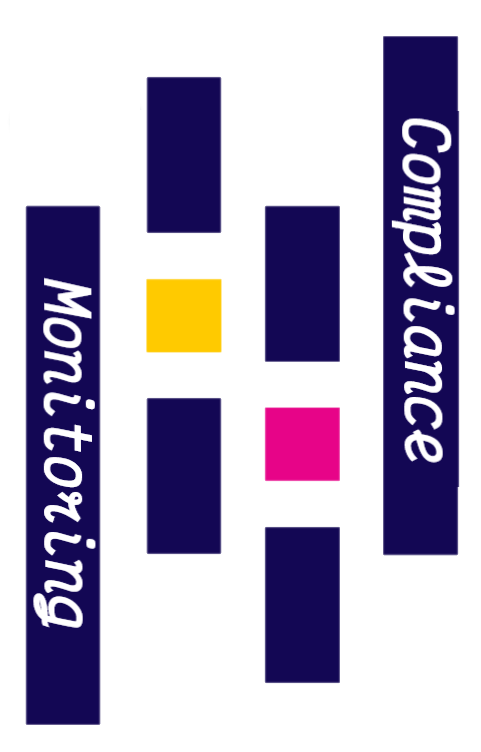

# Vue Logs Screen
Compliance Monitoring AKA **Risk Based Assessment** is a tool for analysis and generating risk scores from compliance data of pharmaceutical industries. The product itself on a much larger scales takes time in debugging and altering stored procedures as per business requirements. 
This Logs Screen acts as an admin panel for the product itself and presents interactive tables for the Developer, Quality Assurance, and Business Analysts for adjusting algorithm weights, the algorithms being executed themselves and a quick overview for the last execution of the ETL or risk engine.
All the current customers, product releases and servers avalable can accessed via a single page application and edited.

On accessing the designated IP and port on the QA server the application has been deployed to you'll be presented with a log in screen. 
If you're new to the CC/CM team please create a new user login password and proceed accorsingly. 
You'll be presented with the *Harry Potter* oath of "I solemnly swear that I'm upto no good" since you'll be accessing sensitive information of the selected customer's database and configuration. 
And the username and password are upside down just to keep things different ??
Select the database server and the client database you'd like to access and click *Fetch Data* which will inturn populate all the tables, the list of which can be accessed from the *Hamburger* menu on the top left of the screen.

<div id="top"></div>
<!--
*** Thanks for checking out the Best-README-Template. If you have a suggestion
*** that would make this better, please fork the repo and create a pull request
*** or simply open an issue with the tag "enhancement".
*** Don't forget to give the project a star!
*** Thanks again! Now go create something AMAZING! :D
-->

<!-- PROJECT SHIELDS -->
<!--
*** I'm using markdown "reference style" links for readability.
*** Reference links are enclosed in brackets [ ] instead of parentheses ( ).
*** See the bottom of this document for the declaration of the reference variables
*** for contributors-url, forks-url, etc. This is an optional, concise syntax you may use.
*** https://www.markdownguide.org/basic-syntax/#reference-style-links
-->
[![MIT License][license-shield]][license-url]

<!-- PROJECT LOGO -->
<br />
<div align="center">
  <a href="https://github.com/Bill-Klay/Vue-Logs-Screen">
    
  </a>

  <h3 align="center">Vue Logs Screen</h3>

  <p align="center">
    An awesome logging screen for your projects!
    <br />
    <a href="https://github.com/Bill-Klay/Vue-Logs-Screen"><strong>Explore the docs »</strong></a>
    <br />
    <br />
    <a href="https://github.com/Bill-Klay/Vue-Logs-Screen">View Demo</a>
    ·
    <a href="https://github.com/Bill-Klay/Vue-Logs-Screen/issues">Report Bug</a>
    ·
    <a href="https://github.com/Bill-Klay/Vue-Logs-Screen/issues">Request Feature</a>
  </p>
</div>

<!-- TABLE OF CONTENTS -->
<details>
  <summary>Table of Contents</summary>
  <ol>
    <li>
      <a href="#about-the-project">About The Project</a>
      <ul>
        <li><a href="#built-with">Built With</a></li>
      </ul>
    </li>
    <li>
      <a href="#getting-started">Getting Started</a>
      <ul>
        <li><a href="#prerequisites">Prerequisites</a></li>
        <li><a href="#installation">Installation</a></li>
      </ul>
    </li>
    <li><a href="#usage">Usage</a></li>
    <li><a href="#roadmap">Roadmap</a></li>
    <li><a href="#contributing">Contributing</a></li>
    <li><a href="#license">License</a></li>
    <li><a href="#contact">Contact</a></li>
    <li><a href="#acknowledgments">Acknowledgments</a></li>
  </ol>
</details>

<!-- ABOUT THE PROJECT -->
## About The Project :book:


This admin panel screen has been developed for the ease and use of developers, quality management team and business analysts in mind.
Configuration and debugging tables are presented on the home screen of the application. 
The single page application uses **Vue** as the frontend framework of choice which is connected to a **Microsoft SQL Server 2019** database at the back and fetches the relied information. 
Changes can be commited, ETL job can be executed and dynamic lists can be refreshed. 
A side **hamburger menu** can be used for the ease of traversal. 
The list of servers is predetermined for the which can be selected from the select database dropdown. 
After selecting the sever the list of database will be populated and the desired one can be selected from the second drop down. 
This drop down is a *multiselect* component of Vue and can be installed seperately. 
On selecting a database the disabled buttons will become available along with the *Reset Defer List* and *Reset Workbench* button becomes visible. 
Once the complete data has been fetched from the selected database a *GIF* will appear along the logo of the application which will basically summarize the results of the last execution and state its status. 
The status are:
* All Good!
* All Good! See some warnings
* Crash!
* Risky Transaction is empty!

The GIF are randomly fetched from a predetermined list which can be found in the assets directory. 
Make ample adjustments to the risk engine and its parameters, hit enter and your query will be saved, but not yet executed. 
To make the visible adjustments to the database itself click on *Commit Changes* and *Execute Job* afterwards to start the ETL process. 
Each table data, button action, and user sessions are maintained via **Flask** server which has been served using **Waitress** due to a windows environment. 
*Flask RESTful* also utilzes a **TinyDB** database for storing user login credentials and maintaining session using *Basic HTTP* authentication using flask's own HTTP auth library. 
Both the frontend and the backend are hosted on a local server by creating a separate **Windows Service** for each. 
An **Express** server was created to run the Vue app and was converted into a windows server using **node-windows**. 
Whilst the Flask server was hosted via server script running waitress and made into a Windows Service via **NSSM** (Non-Sucking Service Manager). 
Please *Log Out* once your purpose of visiting the app is achieved. 

<p align="right">(<a href="#top">back to top</a>)</p>

### Built With :computer:

This section lists the technological stack that was utilized for the purpose of creating this application along with the specific purpose they serve. 

* [Microsoft SQL Server](https://www.microsoft.com/en-us/sql-server) | Database Server
* [Vuetify](https://vuetifyjs.com/en/) | Vue's very own material design framework
* [Vue.js](https://vuejs.org/) | The goto choice for a progresive Frontend design
* [Flask](https://flask.palletsprojects.com/en/2.2.x/) | Flask RESTful for backend
* [NSSM](https://nssm.cc/download) | For creating windows services in the nicest way possible
* [Express.js](http://expressjs.com/) | Fast minimalist Node.js server
* [TinyDB](https://pypi.org/project/tinydb/) | A NoSQL database developed in Python
* [Waitress](https://pypi.org/project/waitress/) | Production grade WSGI for Flask

<p align="right">(<a href="#top">back to top</a>)</p>

<!-- GETTING STARTED -->
## Getting Started

In this section you can get the idea of to setup your own logs screen.

### Prerequisites

Environment setting required:
* npm
  ```sh
  npm install npm@latest -g
  ```

* Python

### Installation

_Below are the instructions for installing the required libraries and frameworks required for the proper functioning of the application._

1. Clone the repo
   ```sh
   git clone https://github.com/Bill-Klay/Vue-Logs-Screen.git
   ```
2. Install NPM packages
   ```sh
   npm install
   ```
3. Install Python packages
   ```sh
   pip install -r requirements.txt
   ```
4. Create Windows Service for the frontend
   ```sh
   node winsw.js
   ```
<p align="right">(<a href="#top">back to top</a>)</p>

<!-- USAGE EXAMPLES -->
## Usage  

The usage is pretty mainstream and has been stated at the start of this ReadMe. 
Besides the viewing functionality of the application we can also edit data across the tables. 
All the flags are presented in color chips which can be flipped. 
On clicking an editable field a dialogue box appears which has been made persistant to avoid accidental confirmations. 
What this means is that the edit box can be cancelled by hitting the **ESC** key, any changes made will be neglected. 
On striking the **Enter** key any changes made to the current cell will be reflected, saved and converted into a query for execution, but not yet commited to the database. 
To do so, click the *Commit Changes* button which will return the status of the changes moved. 


_For more examples, please refer to the Documentation_ at the start.

<p align="right">(<a href="#top">back to top</a>)</p>

<!-- ROADMAP -->
## Roadmap

- [x] Add Files_Specs table
- [x] Add Reset Workbench
- [ ] Add Reset Defer List
- [ ] Adjust tables according to business needs
- [ ] More tables?

See the [open issues](https://github.com/Bill-Klay/Vue-Logs-Screen/issues) for a full list of proposed features (and known issues).

<p align="right">(<a href="#top">back to top</a>)</p>

<!-- CONTRIBUTING -->
## Contributing :busts_in_silhouette:

Contributions are what make the open source community such an amazing place to learn, inspire, and create. Any contributions you make are **greatly appreciated**.

If you have a suggestion that would make this better, please fork the repo and create a pull request. You can also simply open an issue with the tag "enhancement".
Don't forget to give the project a star! Thanks again!

1. Fork the Project
2. Create your Feature Branch (`git checkout -b feature/AmazingFeature`)
3. Commit your Changes (`git commit -m 'Add some AmazingFeature'`)
4. Push to the Branch (`git push origin feature/AmazingFeature`)
5. Open a Pull Request

Thank you for visiting :green_heart:

<p align="right">(<a href="#top">back to top</a>)</p>

<!-- LICENSE -->
## License

Distributed under the MIT License. See `LICENSE.txt` for more information.

<p align="right">(<a href="#top">back to top</a>)</p>

<!-- CONTACT -->
## Contact :email:

* [GitHub](https://github.com/Bill-Klay)
* [Project Link](https://github.com/Bill-Klay/Vue-Logs-Screen)
* [Email](mailto:bilal.khan2998@gmail.com) 
* [LinkedIn](https://www.linkedin.com/in/bilalkhan29/)

<p align="right">(<a href="#top">back to top</a>)</p>

<!-- ACKNOWLEDGMENTS -->
## Acknowledgments :gift:

I've used this space to give credits to a few of my favourite links I had fun visiting while creating this :heart:

* [Choose an Open Source License](https://choosealicense.com)
* [GitHub Emoji Cheat Sheet](https://www.webpagefx.com/tools/emoji-cheat-sheet)
* [Img Shields](https://shields.io)
* [Victor Mono](https://rubjo.github.io/victor-mono/)
* [Doki Theme](https://doki-theme.unthrottled.io/themes/)
* [Who really invented the light bulb?](https://artsandculture.google.com/story/who-really-invented-the-light-bulb-and-other-myths-debunked/cAKSW_mbN0mdJQ)

<p align="right">(<a href="#top">back to top</a>)</p>

<!-- MARKDOWN LINKS & IMAGES -->
<!-- https://www.markdownguide.org/basic-syntax/#reference-style-links -->
[contributors-shield]: https://img.shields.io/github/contributors/othneildrew/Best-README-Template.svg?style=for-the-badge
[contributors-url]: https://github.com/othneildrew/Best-README-Template/graphs/contributors
[forks-shield]: https://img.shields.io/github/forks/othneildrew/Best-README-Template.svg?style=for-the-badge
[forks-url]: https://github.com/othneildrew/Best-README-Template/network/members
[stars-shield]: https://img.shields.io/github/stars/othneildrew/Best-README-Template.svg?style=for-the-badge
[stars-url]: https://github.com/othneildrew/Best-README-Template/stargazers
[issues-shield]: https://img.shields.io/github/issues/othneildrew/Best-README-Template.svg?style=for-the-badge
[issues-url]: https://github.com/othneildrew/Best-README-Template/issues
[license-shield]: https://img.shields.io/github/license/othneildrew/Best-README-Template.svg?style=for-the-badge
[license-url]: https://github.com/othneildrew/Best-README-Template/blob/master/LICENSE.txt
[linkedin-shield]: https://img.shields.io/badge/-LinkedIn-black.svg?style=for-the-badge&logo=linkedin&colorB=555
[linkedin-url]: https://linkedin.com/in/othneildrew
[product-screenshot]: images/screenshot.png
